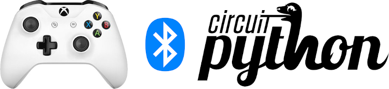
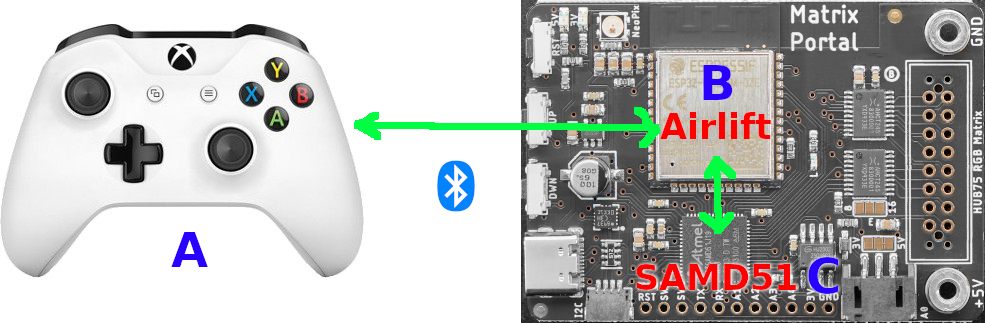

Introduction
============

.. image:: https://github.com/ricardoquesada/bluepad32-circuitpython/workflows/Build%20CI/badge.svg
    :target: https://github.com/ricardoquesada/bluepad32-circuitpython/actions/
    :alt: Build Status

.. image:: https://img.shields.io/discord/775177861665521725.svg
    :target: https://discord.gg/r5aMn6Cw5q
    :alt: Discord

Enables gamepad support for CircuitPython. Requires a board with an AirLift (ESP32) module,
like:

* `Adafruit MatrixPortal M4 <https://www.adafruit.com/product/4745>`_
* `Adafruit Metro M4 Express AirLift <https://www.adafruit.com/product/4000>`_
* `Adafruit PyPortal <https://www.adafruit.com/product/4116>`_
* `Adafruit PyBadge <https://www.adafruit.com/product/4200>`_

Supported gamepads
==================

.. image:: https://lh3.googleusercontent.com/pw/AM-JKLWUZS_vlkMmd3o8EKzXlYCS0uriEW_gXfOoiFqZlABJi_dM1GWYHGafrdMnTP-VHgVdCdVA4pUageZgyI98RH1SHtydac2yyrx_vJVXgWPYBFN-SJoOikdlGuOowPoDqYOwfKU39yketYPJyRJlIPwjEw=-no
    :alt: Supported gamepads

Supports, most if not all, modern Bluetooth gamepads like:

* Sony family: DualSense (PS5), DualShock 4 (PS4), DualShock 3 (PS3)
* Nintendo family: Switch gamepads, Switch JoyCons, Wii, Wii U
* Xbox Wireless
* Android gamepads
* Window gamepads
* 8BitDo controllers
* and more

For a complete list, see: https://gitlab.com/ricardoquesada/bluepad32/-/blob/main/docs/supported_gamepads.md

How does it work
================

As mentioned above, only boards with the AirLift (ESP32) co-processor are supported.
This is because the project consists of two parts:

* "Bluepad32 library for CircuitPython", runs on the main processor: "C"
* "Bluepad32 firmware", runs on the AirLift co-processor: "B"

The gamepad (A), using Bluetooth, connects to the AirLift co-processor (B).

And AirLift (B) sends the gamepad data to the main processor (C). In the case
of the MatrixPortal M4, the main processor is the SAMD51. But it could be
different on other boards.

So, in order to use the library you have to flash the "Bluepad32 firmware" on AirLift.
This is a simple step that needs to be done just once, and can be undone at any time.
Info about Bluepad32 firmware is available here:

* Bluepad32 firmware doc: https://gitlab.com/ricardoquesada/bluepad32/-/blob/master/docs/plat_airlift.md
* Download: https://gitlab.com/ricardoquesada/bluepad32/-/releases

Dependencies
============

This driver depends on:

* `Adafruit ESP32SPI <https://github.com/adafruit/Adafruit_CircuitPython_ESP32SPI>`_

Please ensure all dependencies are available on the CircuitPython filesystem.
This is easily achieved by downloading
`the Adafruit library and driver bundle <https://circuitpython.org/libraries>`_
or individual libraries can be installed using
`circup <https://github.com/adafruit/circup>`_.

Installing to a Connected CircuitPython Device with Circup
==========================================================

Make sure that you have ``circup`` installed in your Python environment.
Install it with the following command if necessary:

.. code-block:: shell

    pip3 install circup

With ``circup`` installed and your CircuitPython device connected use the
following command to install:

.. code-block:: shell

    circup install bluepad32

Or the following command to update an existing version:

.. code-block:: shell

    circup update

Usage Example
=============

.. code-block:: python

    import time
    import board
    import busio
    from digitalio import DigitalInOut
    from bluepad32.bluepad32 import Bluepad32

    # Connected gamepad
    gamepad = None

    # Callback that will be called once a gamepad is connected
    def on_connect(gp):
        global gamepad
        gamepad = gp

        print("on_connect: ", gp)
        # Change ligthbar to Green: Red, Green, Blue
        gp.set_lightbar_color((0x00, 0xFF, 0x00))

    # Callback that will be called when a gamepad is disconnected
    def on_disconnect(gp):
        global gamepad
        gamepad = None
        print("on_disconnect: ", gp)

    # If you are using a board with pre-defined ESP32 Pins:
    
    esp32_cs = DigitalInOut(board.ESP_CS)
    esp32_ready = DigitalInOut(board.ESP_BUSY)
    esp32_reset = DigitalInOut(board.ESP_RESET)

    spi = busio.SPI(board.SCK, board.MOSI, board.MISO)
    bp32 = Bluepad32(spi, esp32_cs, esp32_ready, esp32_reset, debug=0)
    bp32.setup_callbacks(on_connect, on_disconnect)

    # For Arduino Nano RP2040 connect the pins will be:
    # esp32_cs = DigitalInOut(board.CS1)
    # esp32_ready = DigitalInOut(board.ESP_BUSY)
    # esp32_reset = DigitalInOut(board.ESP_RESET)

    # spi = busio.SPI(board.SCK1, board.MOSI1, board.MISO1)
    # bp32 = Bluepad32(spi, esp32_cs, esp32_ready, esp32_reset, debug=0)
    # bp32.setup_callbacks(on_connect, on_disconnect)

    # Should display "Bluepad32 for Airlift vXXX"
    print("Firmware version:", bp32.firmware_version)

    while True:
        # Fetches data from Bluepad32 firmware, triggers callbaks, and more.
        # Must be called once per frame.
        bp32.update()

        if gamepad is None:
            continue

        if gamepad.button_a:  # button A pressed ?
            # Change color to Blue
            gamepad.set_lightbar_color((0x00, 0x00, 0xFF))

        if gamepad.button_b:  # Button B pressed ?
            # Turn on all 4 player LEDs
            gamepad.set_player_leds(0x0f)

        if gamepad.button_x:  # Button X pressed ?
            force = 128  # 0-255
            duration = 10  # 0-255
            gamepad.set_rumble(force, duration)

        # Small delay, simulates a 30 FPS game
        time.sleep(0.032)

Contributing
============

Contributions are welcome! Please read our `Code of Conduct
<https://github.com/ricardoquesada/CircuitPython_Org_bluepad32/blob/HEAD/CODE_OF_CONDUCT.md>`_
before contributing to help this project stay welcoming.
